```r
#! /usr/bin/env Rscript

#
#   Description: report plotting calls
#   Analyzing pre and post survey results from Data Carpentry 
#   Repo: https://github.com/carpentries/assessment-projects/tree/master/data-carpentry-projects
#   Date: 2017, August 27
#   Copyright (C) 2017 Paula Andrea Martinez
#   ORCID iD 0000-0002-8990-1985

source(file = "scripts/exploringData.R")
```

```
## Warning in file(filename, "r", encoding = encoding): cannot open file
## 'scripts/exploringData.R': No such file or directory
```

```
## Error in file(filename, "r", encoding = encoding): cannot open the connection
```

```r
# ###########################################################################
# Calls 
# Run line by line
# ###########################################################################
```

```r
Epreworkshop <- Exploring("data/preworkshop_public_archived.csv")
```

```
## Warning in file(file, "rt"): cannot open file 'data/
## preworkshop_public_archived.csv': No such file or directory
```

```
## Error in file(file, "rt"): cannot open the connection
```

```r
Epreworkshop <- cleanPreworkshopdata(Epreworkshop)
```

```
##  [1] "Start.Date"               "End.Date"                
##  [3] "When.Taking.Survey"       "First.Time"              
##  [5] "Status"                   "Status.Other"            
##  [7] "Department"               "Discipline"              
##  [9] "Discipline.Other"         "OS"                      
## [11] "With.Friend"              "Programming.Usage"       
## [13] "Current.Tools.1"          "Current.Tools.2"         
## [15] "Current.Tools.3"          "Current.Tools.4"         
## [17] "Current.Tools.5"          "Current.Tools.6"         
## [19] "Current.Tools.7"          "Have.Dataset"            
## [21] "Data.Management.Strategy" "Data.Analysis.Workflow"  
## [23] "Data.Organization"        "Using.Scripting.Language"
## [25] "Using.R.or.Python"        "Value.of.SQL.or.Python"  
## [27] "Hope.to.Learn"            "Workshop.in.US"          
## [29] "Age"                      "Gender"                  
## [31] "Gender.Other"             "Race"                    
## [33] "Race.Other"               "year.survey"             
## [1] "Post-doc"              "Industry"              "Graduate Student"     
## [4] "Undergraduate Student" "Faculty"               "Other"                
## [7] "No Answer"            
## [1] "Male"              "Prefer not to say" "No Answer"        
## [1] "Asian / Pacific Islander"                 
## [2] "Black or African American"                
## [3] "Hispanic or Latino"                       
## [4] "Native Hawaiian or Other Pacific Islander"
## [5] "White / Caucasian"                        
## [6] "Other"                                    
## [7] "No Answer"                                
## [1] "Data contains 2343 rows and 34 columns"
```

```
## Warning in file(file, ifelse(append, "a", "w")): cannot open file 'data/
## clean_presurvey.csv': No such file or directory
```

```
## Error in file(file, ifelse(append, "a", "w")): cannot open the connection
```

```r
plotByStatusGeneric(Epreworkshop, "Pre-survey", "year.survey" , "year of survey response")
```

```
## [1] 2343   34
## [1] "year.survey"
## [1] 2343   34
## 
## 2016 2017 
## 1358  985
```

```
## Error in grDevices::dev.off(): QuartzBitmap_Output - unable to open file './plots/Pre-survey_Status_yearsurvey.png'
```

```r
plotByStatusGeneric(Epreworkshop, "Pre-survey", "First.Time" , "first time taking a DC as learner", c(2,1))
```

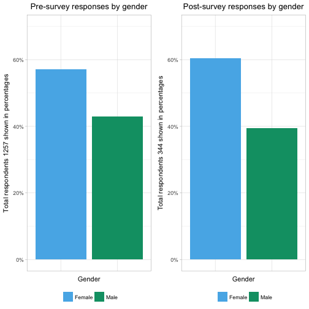

```
## [1] 2343   34
## [1] "First.Time"
## [1] 2063   34
## 
##   No  Yes 
##  120 1943 
## [1] "Yes" "No"
```

```
## Error in grDevices::dev.off(): QuartzBitmap_Output - unable to open file './plots/Pre-survey_Status_FirstTime.png'
```

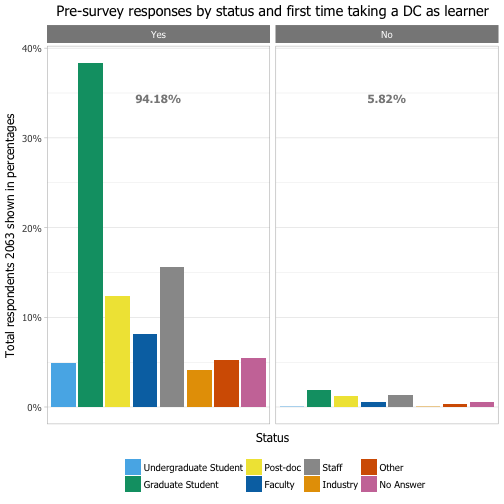

```r
# Simple barplot for discipline, Biology has the majority of answers
plotBarplot(Epreworkshop, "Pre-survey", "Discipline", "discipline")
```

```
## Error in grDevices::dev.off(): QuartzBitmap_Output - unable to open file 'plots/Pre-survey_discipline.png'
```

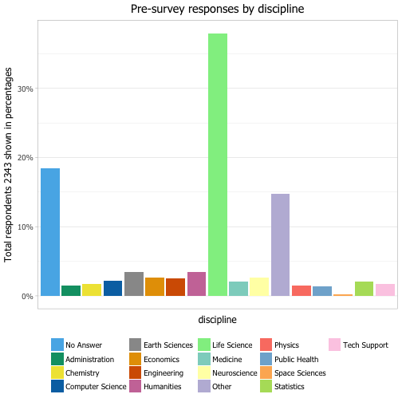

```r
plotByStatusGeneric(Epreworkshop, "Pre-survey", "OS" , "operative system", c(1,2,4,3))
```

```
## [1] 2343   34
## [1] "OS"
## [1] 1925   34
## 
## Apple OS    Linux Not sure  Windows 
##      769       67       53     1036 
## [1] "Apple OS" "Linux"    "Windows"  "Not sure"
```

```
## Error in grDevices::dev.off(): QuartzBitmap_Output - unable to open file './plots/Pre-survey_Status_OS.png'
```

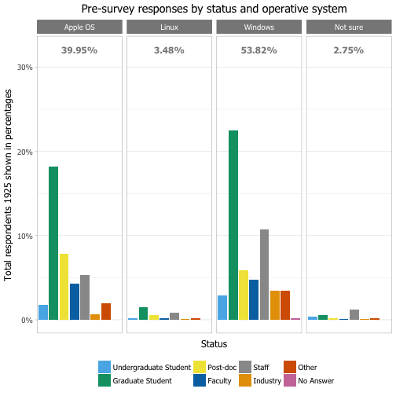

```r
# table(Epreworkshop$With.Friend)
plotByStatusGeneric(Epreworkshop, "Pre-survey", "With.Friend" , "attended with a friend", c(3,1,2))
```

```
## [1] 2343   34
## [1] "With.Friend"
## [1] 1922   34
## 
##       No Not sure      Yes 
##      620      375      927 
## [1] "Yes"      "No"       "Not sure"
```

```
## Error in grDevices::dev.off(): QuartzBitmap_Output - unable to open file './plots/Pre-survey_Status_WithFriend.png'
```

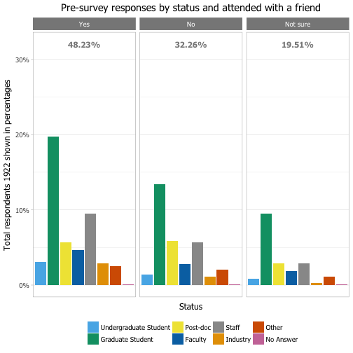

```r
# table(Epreworkshop$Programming.Usage)
plotByStatusGeneric(Epreworkshop, "Pre-survey", "Programming.Usage" , "programming usage", c(2, 3, 6, 4, 7, 1, 5))
```

```
## [1] 2343   34
## [1] "Programming.Usage"
## [1] 1871   34
## 
##                   Daily I have never programmed   Less than once a year 
##                     261                     501                     322 
##                 Monthly                Not sure    Several times a year 
##                     167                      34                     319 
##                  Weekly 
##                     267 
## [1] "I have never programmed" "Less than once a year"  
## [3] "Several times a year"    "Monthly"                
## [5] "Weekly"                  "Daily"                  
## [7] "Not sure"
```

```
## Error in grDevices::dev.off(): QuartzBitmap_Output - unable to open file './plots/Pre-survey_Status_ProgrammingUsage.png'
```

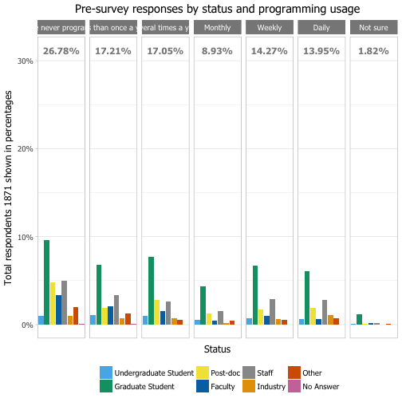

```r
# Skipping current tools "Current.Tools.1" to "Current.Tools.7"
# table(Epreworkshop$Have.Dataset)
plotByStatusGeneric(Epreworkshop, "Pre-survey", "Have.Dataset" , "having a dataset", c(2,1,4,3))
```

```
## [1] 2343   34
## [1] "Have.Dataset"
## [1] 1859   34
## 
##              I am working on generating data 
##                                          361 
##                       I do not have data yet 
##                                          518 
##  I have data and done a fair bit of analysis 
##                                          557 
## I have data but haven't started analyzing it 
##                                          423 
## [1] "I do not have data yet"                      
## [2] "I am working on generating data"             
## [3] "I have data but haven't started analyzing it"
## [4] "I have data and done a fair bit of analysis"
```

```
## Error in grDevices::dev.off(): QuartzBitmap_Output - unable to open file './plots/Pre-survey_Status_HaveDataset.png'
```

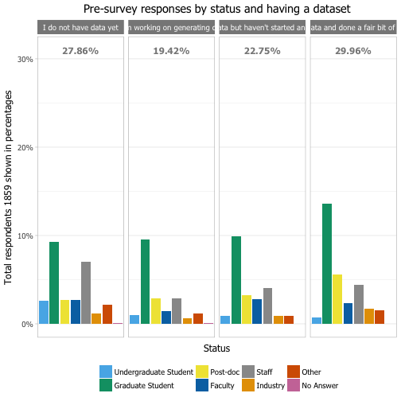

```r
# "Data.Management.Strategy" "Data.Analysis.Workflow" are better plotted with a Likert plot 
# table(Epreworkshop$Data.Management.Strategy)
# table(Epreworkshop$Data.Analysis.Workflow)
plotByStatusGeneric(Epreworkshop, "Pre-survey", "Data.Organization" , "importance of data organization", c(4,1,3,2,5))
```

```
## [1] 2343   34
## [1] "Data.Organization"
## [1] 1852   34
## 
##             Agree          Disagree           Neutral    Strongly agree 
##               590                 9                60              1135 
## Strongly disagree 
##                58 
## [1] "Strongly agree"    "Agree"             "Neutral"          
## [4] "Disagree"          "Strongly disagree"
```

```
## Error in grDevices::dev.off(): QuartzBitmap_Output - unable to open file './plots/Pre-survey_Status_DataOrganization.png'
```

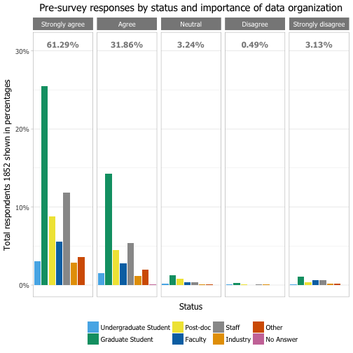

```r
# table(Epreworkshop$Using.Scripting.Language)
plotByStatusGeneric(Epreworkshop, "Pre-survey", "Using.Scripting.Language" , "importance of using a scripting language",  c(4,1,3,2,5))
```

```
## [1] 2343   34
## [1] "Using.Scripting.Language"
## [1] 1844   34
## 
##             Agree          Disagree           Neutral    Strongly agree 
##               589                11               306               895 
## Strongly disagree 
##                43 
## [1] "Strongly agree"    "Agree"             "Neutral"          
## [4] "Disagree"          "Strongly disagree"
```

```
## Error in grDevices::dev.off(): QuartzBitmap_Output - unable to open file './plots/Pre-survey_Status_UsingScriptingLanguage.png'
```

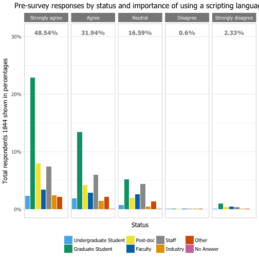

```r
# ### Skipped because question is not clear
# table(Epreworkshop$Using.R.or.Python)
# table(Epreworkshop$Value.of.SQL.or.Python)
# Taken in the US
# table(Epreworkshop$Workshop.in.US)
# 31% No 69% Yes
#(590 * 100) / 1890  
# ### [1] 31.21693
#(1307 * 100) / 1890  
# ###[1] 69.15344
plotByStatusGeneric(Epreworkshop, "Pre-survey", "Workshop.in.US" , "workshop taken in the US")
```

```
## [1] 2343   34
## [1] "Workshop.in.US"
## [1] 1897   34
## 
##   No  Yes 
##  590 1307
```

```
## Error in grDevices::dev.off(): QuartzBitmap_Output - unable to open file './plots/Pre-survey_Status_WorkshopinUS.png'
```

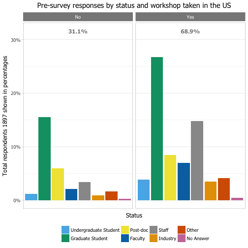

```r
# make workshop in the US per year
plotGeneric(Epreworkshop, "Pre-survey", "Workshop.in.US" , "workshop taken in the US per year", c(2,1), "year.survey" )
```

```
## [1] 2343   34
## [1] "Workshop.in.US"
## [1] "year.survey"
## [1] 1897   34
## [1] "Yes" "No" 
##      
##       2016 2017
##   Yes  706  601
##   No   393  197
```

```
## Error in grDevices::dev.off(): QuartzBitmap_Output - unable to open file './plots/Pre-survey_year.survey_WorkshopinUS.png'
```

```r
# this is very interesting, shows that for 2017 only 10% of respondents have taken the survey outside of the US
plotByStatusGeneric(Epreworkshop, "Pre-survey", "Age" , "age")
```

```
## [1] 2343   34
## [1] "Age"
## [1] 1279   34
## 
##             18-24             25-34             35-44             45-54 
##               210               579               250               133 
##             55-64             65-74 Prefer not to say 
##                72                12                23
```

```
## Error in grDevices::dev.off(): QuartzBitmap_Output - unable to open file './plots/Pre-survey_Status_Age.png'
```


```r
plotGeneric(Epreworkshop, "Pre-survey", "Age" , "age per year",NULL, "year.survey")
```

```
## [1] 2343   34
## [1] "Age"
## [1] "year.survey"
## [1] 1279   34
##                    
##                     2016 2017
##   18-24               93  117
##   25-34              281  298
##   35-44              152   98
##   45-54               89   44
##   55-64               55   17
##   65-74                6    6
##   Prefer not to say   19    4
```

```
## Error in grDevices::dev.off(): QuartzBitmap_Output - unable to open file './plots/Pre-survey_year.survey_Age.png'
```

```r
# doesn't really mean that more people in the US came with a friend, it just looks like that because more people
# have taken the survey in the US
plotGeneric(Epreworkshop, "Pre-survey","With.Friend" , "came with friend vs taken in the US", c(3,1,2), 
            "Workshop.in.US" , c(2,1)) 
```

```
## [1] 2343   34
## [1] "With.Friend"
## [1] "Workshop.in.US"
## [1] 1869   34
## [1] "Yes"      "No"       "Not sure"
## [1] "Yes" "No" 
##           
##            Yes  No
##   Yes      604 296
##   No       415 187
##   Not sure 267 100
```

```
## Error in grDevices::dev.off(): QuartzBitmap_Output - unable to open file './plots/Pre-survey_Workshop.in.US_WithFriend.png'
```

```r
plotGeneric(Epreworkshop, "Pre-survey", "OS", "OS vs taken in the US", c(1,2,4,3), "Workshop.in.US" , c(2,1)) 
```

```
## [1] 2343   34
## [1] "OS"
## [1] "Workshop.in.US"
## [1] 1872   34
## [1] "Apple OS" "Linux"    "Windows"  "Not sure"
## [1] "Yes" "No" 
##           
##            Yes  No
##   Apple OS 542 207
##   Linux     41  24
##   Windows  668 338
##   Not sure  38  14
```

```
## Error in grDevices::dev.off(): QuartzBitmap_Output - unable to open file './plots/Pre-survey_Workshop.in.US_OS.png'
```

```r
plotGeneric(Epreworkshop, "Pre-survey", "OS", "OS vs year of the survey", c(1,2,4,3), "year.survey" ) 
```

```
## [1] 2343   34
## [1] "OS"
## [1] "year.survey"
## [1] 1925   34
## [1] "Apple OS" "Linux"    "Windows"  "Not sure"
##           
##            2016 2017
##   Apple OS  422  347
##   Linux      41   26
##   Windows   633  403
##   Not sure   25   28
```

```
## Error in grDevices::dev.off(): QuartzBitmap_Output - unable to open file './plots/Pre-survey_year.survey_OS.png'
```

```r
# Filter all of those who did not take the survey in the US 
EpreworkshopUS <- subset(Epreworkshop, Workshop.in.US == "Yes")
dim(EpreworkshopUS)
```

```
## [1] 1307   34
```

```r
plotByStatusGeneric(EpreworkshopUS, "Pre-surveyUS", "Age" , "age")
```

```
## [1] 1307   34
## [1] "Age"
## [1] 1279   34
## 
##             18-24             25-34             35-44             45-54 
##               210               579               250               133 
##             55-64             65-74 Prefer not to say 
##                72                12                23
```

```
## Error in grDevices::dev.off(): QuartzBitmap_Output - unable to open file './plots/Pre-surveyUS_Status_Age.png'
```

```r
# Gender... this is not a reality, it only means that more women responded in the survey
# not that there were more women have taken the workshop
plotByStatusGeneric(EpreworkshopUS, "Pre-surveyUS", "Gender" , "gender")
```

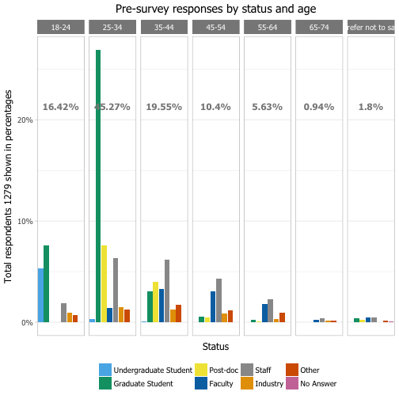

```
## [1] 1307   34
## [1] "Gender"
## [1] 1307   34
## 
##            Female              Male Prefer not to say         No Answer 
##               717               540                22                28
```

```
## Error in grDevices::dev.off(): QuartzBitmap_Output - unable to open file './plots/Pre-surveyUS_Status_Gender.png'
```


```r
# Combined plot
plotGeneric(EpreworkshopUS, "Pre-surveyUS","With.Friend" , "came with friend vs gender", c(3,1,2), 
            "Gender" ) 
```

```
## [1] 1307   34
## [1] "With.Friend"
## [1] "Gender"
## [1] 1286   34
## [1] "Yes"      "No"       "Not sure"
##           
##            Female Male Prefer not to say No Answer
##   Yes         329  257                10         8
##   No          234  173                 6         2
##   Not sure    148  110                 6         3
```

```
## Error in grDevices::dev.off(): QuartzBitmap_Output - unable to open file './plots/Pre-surveyUS_Gender_WithFriend.png'
```

```r
# Names are too long to be shown in categories 
plotByStatusGeneric(EpreworkshopUS, "Pre-surveyUS", "Race" , "race")
```

```
## [1] 1307   34
## [1] "Race"
## [1] 1307   34
## 
##         American Indian or Alaskan Native 
##                                         2 
##                  Asian / Pacific Islander 
##                                       290 
##                 Black or African American 
##                                        56 
##                        Hispanic or Latino 
##                                        57 
## Native Hawaiian or Other Pacific Islander 
##                                         1 
##                         White / Caucasian 
##                                       735 
##                         Prefer not to say 
##                                        81 
##                                     Other 
##                                        42 
##                                 No Answer 
##                                        43
```

```
## Error in grDevices::dev.off(): QuartzBitmap_Output - unable to open file './plots/Pre-surveyUS_Status_Race.png'
```


```r
# wordclouds
myWordCloud(Epreworkshop$Department, "Pre-survey_Department")
```

```
## Error in Corpus(VectorSource(mydata)): could not find function "Corpus"
```

```r
myWordCloud(Epreworkshop$Hope.to.Learn, "Pre-survey_HopeToLearn")
```

```
## Error in Corpus(VectorSource(mydata)): could not find function "Corpus"
```

```r
# ############################################################################
```

```r
Epostworkshop <- Exploring("data/postworkshop_public_archived.csv")
```

```
## Warning in file(file, "rt"): cannot open file 'data/
## postworkshop_public_archived.csv': No such file or directory
```

```
## Error in file(file, "rt"): cannot open the connection
```

```r
Epostworkshop <- cleanPostworkshopdata(Epostworkshop)
```

```
## [1] 1081   44
##  [1] "Start.Date"                "End.Date"                 
##  [3] "When.Taking.Survey"        "First.Time"               
##  [5] "Research"                  "Status"                   
##  [7] "Status.Other"              "Involvement"              
##  [9] "Practical.Knowledge"       "Organize.Data"            
## [11] "Use.OpenRefine"            "Import.Python"            
## [13] "Import.R"                  "Visualizations.in.Python" 
## [15] "Visualizations.in.R"       "Construct.SQL"            
## [17] "Use.command.line"          "Skill.Level.Prior"        
## [19] "Skill.Level.Following"     "Data.Organization"        
## [21] "Using.Scripting.Language"  "Using.R.or.Python"        
## [23] "Value.of.SQL.or.Python"    "Application"              
## [25] "Worth.My.Time"             "Material"                 
## [27] "Recommend"                 "Instructors.Clear.Answers"
## [29] "Instructors.Considerate"   "Instructors.Effective"    
## [31] "Instructors.Enthusiastic"  "Workshop.in.US"           
## [33] "Age"                       "Gender"                   
## [35] "Gender.Other"              "Race.American.Indian"     
## [37] "Race.Asian"                "Race.Black"               
## [39] "Race.Hispanic"             "Race.Islander"            
## [41] "Race.White"                "Race.Prefer.Not"          
## [43] "Race.Other"                "year.survey"              
## [1] "Post-doc"              "Industry"              "Graduate student"     
## [4] "Undergraduate Student" "Faculty"               "Other"                
## [7] "No Answer"            
## [1] "Male"              "Prefer not to say" "No Answer"        
## [1] "Data contains 1081 rows and 44 columns"
```

```
## Warning in file(file, ifelse(append, "a", "w")): cannot open file 'data/
## clean_postsurvey.csv': No such file or directory
```

```
## Error in file(file, ifelse(append, "a", "w")): cannot open the connection
```

```r
# Postworkshop has about half the entries in comparison with the preworkshop 
```

```r
# 2017 has of course less entries because it contains only answers of half a year
plotByStatusGeneric(Epostworkshop, "Post-survey", "year.survey" , "year of survey response")
```

```
## [1] 1081   44
## [1] "year.survey"
## [1] 1080   44
## 
## 2016 2017 
##  602  478
```

```
## Error in grDevices::dev.off(): QuartzBitmap_Output - unable to open file './plots/Post-survey_Status_yearsurvey.png'
```

```r
# there is not much to do with columns that are repeated with the pre-survey
# #  "When.Taking.Survey"        "First.Time"
# # "Research" is a text field wich is difficult to categorize
# table(Epostworkshop$Involvement)
plotByStatusGeneric(Epostworkshop, "Post-survey", "Involvement" , "level of involvement", c(3,1,2))
```


```
## [1] 1081   44
## [1] "Involvement"
## [1] 1008   44
## 
## Enthusiastically involved         Somewhat involved 
##                       347                       149 
##             Very involved 
##                       512 
## [1] "Very involved"             "Enthusiastically involved"
## [3] "Somewhat involved"
```

```
## Error in grDevices::dev.off(): QuartzBitmap_Output - unable to open file './plots/Post-survey_Status_Involvement.png'
```

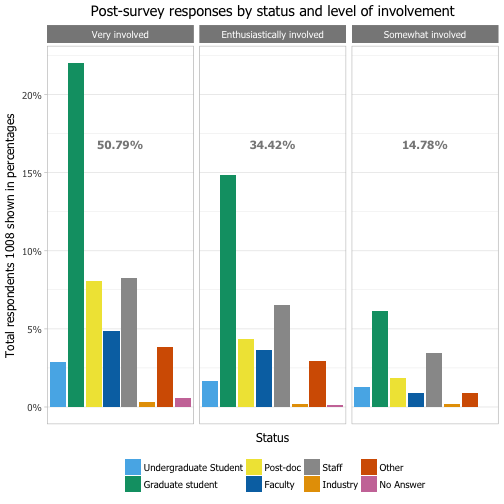

```r
# table(Epostworkshop$Practical.Knowledge)
plotByStatusGeneric(Epostworkshop, "Post-survey", "Practical.Knowledge" , "practical knowledge gained", c(1, 3, 2))
```

```
## [1] 1081   44
## [1] "Practical.Knowledge"
## [1] 1009   44
## 
##             A great deal                     None Some practical knowledge 
##                      585                        6                      418 
## [1] "A great deal"             "Some practical knowledge"
## [3] "None"
```

```
## Error in grDevices::dev.off(): QuartzBitmap_Output - unable to open file './plots/Post-survey_Status_PracticalKnowledge.png'
```

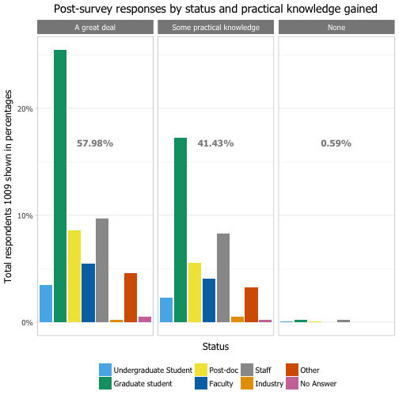

```r
plotGeneric(Epostworkshop, "Post-survey", "Practical.Knowledge" , 
            "practical knowledge gained vs level of involvement", c(1, 3, 2),"Involvement", c(3,1,2)) 
```

```
## [1] 1081   44
## [1] "Practical.Knowledge"
## [1] "Involvement"
## [1] 1007   44
## [1] "A great deal"             "Some practical knowledge"
## [3] "None"                    
## [1] "Very involved"             "Enthusiastically involved"
## [3] "Somewhat involved"        
##                           
##                            Very involved Enthusiastically involved
##   A great deal                       267                       267
##   Some practical knowledge           245                        79
##   None                                 0                         0
##                           
##                            Somewhat involved
##   A great deal                            50
##   Some practical knowledge                93
##   None                                     6
```

```
## Error in grDevices::dev.off(): QuartzBitmap_Output - unable to open file './plots/Post-survey_Involvement_PracticalKnowledge.png'
```

```r
# #####The folowwing will be better with a Likert plot
# # "Organize.Data"             "Use.OpenRefine"            "Import.Python"            
# # [13] "Import.R"                  "Visualizations.in.Python"  "Visualizations.in.R"       "Construct.SQL"            
# # [17] "Use.command.line" 
# # For information of each question
# table(Epostworkshop$Organize.Data)
plotByStatusGeneric(Epostworkshop, "Post-survey", "Organize.Data" , "better understanding on how to organize data in spreadsheets", c(5,1,4,2,6,3)) 
```

```
## [1] 1081   44
## [1] "Organize.Data"
## [1] 965  44
## 
##                           Agree                        Disagree 
##                             362                              28 
## NA/Not covered at this workshop                         Neutral 
##                              81                             161 
##                  Strongly Agree               Strongly Disagree 
##                             311                              22 
## [1] "Strongly Agree"                  "Agree"                          
## [3] "Neutral"                         "Disagree"                       
## [5] "Strongly Disagree"               "NA/Not covered at this workshop"
```

```
## Error in grDevices::dev.off(): QuartzBitmap_Output - unable to open file './plots/Post-survey_Status_OrganizeData.png'
```

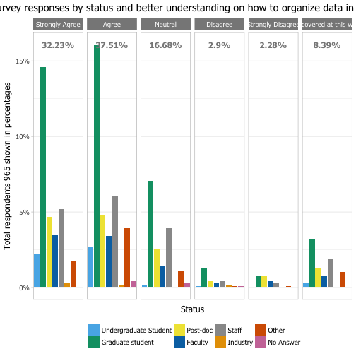

```r
# table(Epostworkshop$Use.OpenRefine)
plotByStatusGeneric(Epostworkshop, "Post-survey", "Use.OpenRefine" , "better understanding on how to use OpenRefine for data cleaning", c(5,1,4,2,6,3)) 
```

```
## [1] 1081   44
## [1] "Use.OpenRefine"
## [1] 960  44
## 
##                           Agree                        Disagree 
##                             247                              31 
## NA/Not covered at this workshop                         Neutral 
##                             215                              85 
##                  Strongly Agree               Strongly disagree 
##                             351                              31 
## [1] "Strongly Agree"                  "Agree"                          
## [3] "Neutral"                         "Disagree"                       
## [5] "Strongly disagree"               "NA/Not covered at this workshop"
```

```
## Error in grDevices::dev.off(): QuartzBitmap_Output - unable to open file './plots/Post-survey_Status_UseOpenRefine.png'
```

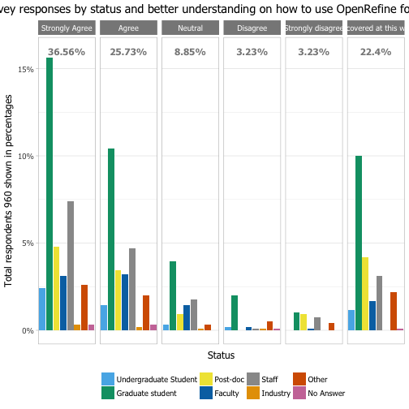

```r
# table(Epostworkshop$Import.Python)
# it seems like half of the workshops did not cover python 
plotByStatusGeneric(Epostworkshop, "Post-survey", "Import.Python" , "better understanding on how to import a file in Python and work with the data",  c(5,1,4,2,6,3)) 
```

```
## [1] 1081   44
## [1] "Import.Python"
## [1] 954  44
## 
##                           Agree                        Disagree 
##                             107                              70 
## NA/Not covered at this workshop                         Neutral 
##                             521                              96 
##                  Strongly Agree               Strongly disagree 
##                              97                              63 
## [1] "Strongly Agree"                  "Agree"                          
## [3] "Neutral"                         "Disagree"                       
## [5] "Strongly disagree"               "NA/Not covered at this workshop"
```

```
## Error in grDevices::dev.off(): QuartzBitmap_Output - unable to open file './plots/Post-survey_Status_ImportPython.png'
```

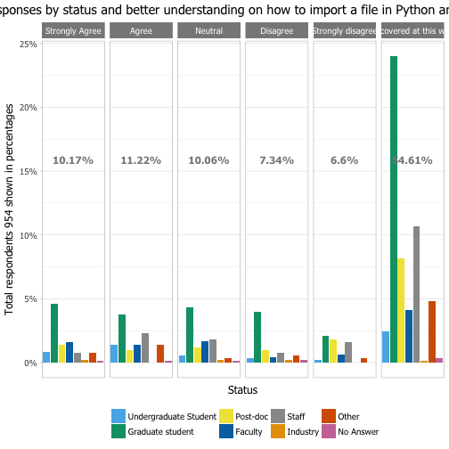

```r
# table(Epostworkshop$Visualizations.in.Python)
plotByStatusGeneric(Epostworkshop, "Post-survey", "Visualizations.in.Python" , "better understanding on how to do visualizations in Python",  c(5,1,4,2,6,3)) 
```

```
## [1] 1081   44
## [1] "Visualizations.in.Python"
## [1] 958  44
## 
##                           Agree                        Disagree 
##                             108                              78 
## NA/Not covered at this workshop                         Neutral 
##                             526                             105 
##                  Strongly Agree               Strongly disagree 
##                              76                              65 
## [1] "Strongly Agree"                  "Agree"                          
## [3] "Neutral"                         "Disagree"                       
## [5] "Strongly disagree"               "NA/Not covered at this workshop"
```

```
## Error in grDevices::dev.off(): QuartzBitmap_Output - unable to open file './plots/Post-survey_Status_VisualizationsinPython.png'
```

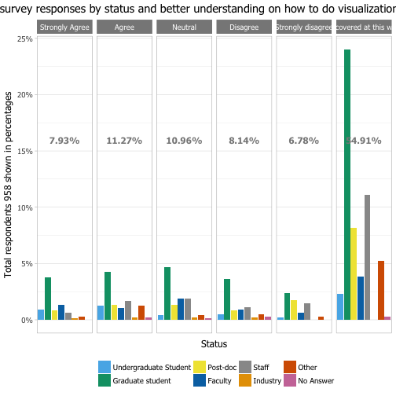

```r
# table(Epostworkshop$Import.R)
# It seems like almost half (40%) of the workshops covered R
plotByStatusGeneric(Epostworkshop, "Post-survey", "Import.R" , "better understanding on how to import a file in R and work with the data",  c(5,1,4,2,6,3)) 
```

```
## [1] 1081   44
## [1] "Import.R"
## [1] 967  44
## 
##                           Agree                        Disagree 
##                             281                              32 
## NA/Not covered at this workshop                         Neutral 
##                             159                              74 
##                  Strongly Agree               Strongly Disagree 
##                             391                              30 
## [1] "Strongly Agree"                  "Agree"                          
## [3] "Neutral"                         "Disagree"                       
## [5] "Strongly Disagree"               "NA/Not covered at this workshop"
```

```
## Error in grDevices::dev.off(): QuartzBitmap_Output - unable to open file './plots/Post-survey_Status_ImportR.png'
```

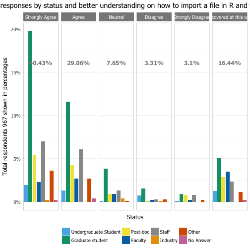

```r
# table(Epostworkshop$Visualizations.in.R)
plotByStatusGeneric(Epostworkshop, "Post-survey", "Visualizations.in.R" , "better understanding on how to do visualizations in R",  c(5,1,4,2,6,3)) 
```

```
## [1] 1081   44
## [1] "Visualizations.in.R"
## [1] 960  44
## 
##                           Agree                        Disagree 
##                             307                              26 
## NA/Not covered at this workshop                         Neutral 
##                             163                              73 
##                  Strongly Agree               Strongly disagree 
##                             361                              30 
## [1] "Strongly Agree"                  "Agree"                          
## [3] "Neutral"                         "Disagree"                       
## [5] "Strongly disagree"               "NA/Not covered at this workshop"
```

```
## Error in grDevices::dev.off(): QuartzBitmap_Output - unable to open file './plots/Post-survey_Status_VisualizationsinR.png'
```

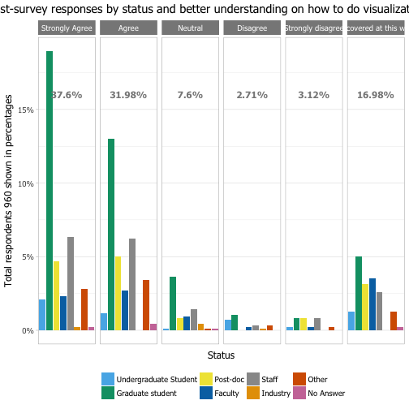

```r
# table(Epostworkshop$Construct.SQL)
plotByStatusGeneric(Epostworkshop, "Post-survey", "Construct.SQL" , "better understanding on how to construct SQL queries",  c(5,1,4,2,6,3)) 
```

```
## [1] 1081   44
## [1] "Construct.SQL"
## [1] 948  44
## 
##                           Agree                        Disagree 
##                             208                              52 
## NA/Not covered at this workshop                         Neutral 
##                             334                             106 
##                  Strongly Agree               Strongly disagree 
##                             203                              45 
## [1] "Strongly Agree"                  "Agree"                          
## [3] "Neutral"                         "Disagree"                       
## [5] "Strongly disagree"               "NA/Not covered at this workshop"
```

```
## Error in grDevices::dev.off(): QuartzBitmap_Output - unable to open file './plots/Post-survey_Status_ConstructSQL.png'
```


```r
# table(Epostworkshop$Use.command.line)
plotByStatusGeneric(Epostworkshop, "Post-survey", "Use.command.line" , "better understanding on how to use command line",  c(5,1,4,2,6,3)) 
```

```
## [1] 1081   44
## [1] "Use.command.line"
## [1] 949  44
## 
##                           Agree                        Disagree 
##                             267                              32 
## NA/Not covered at this workshop                         Neutral 
##                             190                             120 
##                  Strongly Agree               Strongly disagree 
##                             313                              27 
## [1] "Strongly Agree"                  "Agree"                          
## [3] "Neutral"                         "Disagree"                       
## [5] "Strongly disagree"               "NA/Not covered at this workshop"
```

```
## Error in grDevices::dev.off(): QuartzBitmap_Output - unable to open file './plots/Post-survey_Status_Usecommandline.png'
```

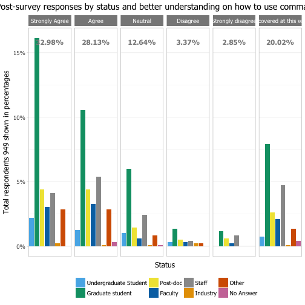

```r
# table(Epostworkshop$Skill.Level.Prior)
plotByStatusGeneric(Epostworkshop, "Post-survey", "Skill.Level.Prior" , "data management and analysis skills prior the workshop", c(4,1,3,2,5))
```

```
## [1] 1081   44
## [1] "Skill.Level.Prior"
## [1] 969  44
## 
##                 High                  Low Neither high nor low 
##                  218                  230                  402 
##            Very high             Very low 
##                   14                  105 
## [1] "Very high"            "High"                 "Neither high nor low"
## [4] "Low"                  "Very low"
```

```
## Error in grDevices::dev.off(): QuartzBitmap_Output - unable to open file './plots/Post-survey_Status_SkillLevelPrior.png'
```

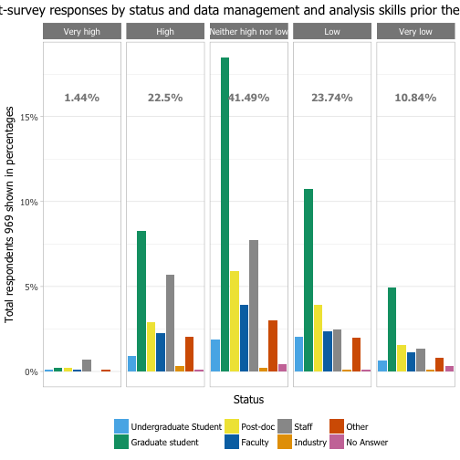

```r
# Combined plot
plotGeneric(Epostworkshop, "Post-survey", "Skill.Level.Prior" , 
            "skills prior the workshop vs level of involvement", c(4,1,3,2,5),"Involvement", c(3,1,2)) 
```

```
## [1] 1081   44
## [1] "Skill.Level.Prior"
## [1] "Involvement"
## [1] 964  44
## [1] "Very high"            "High"                 "Neither high nor low"
## [4] "Low"                  "Very low"            
## [1] "Very involved"             "Enthusiastically involved"
## [3] "Somewhat involved"        
##                       
##                        Very involved Enthusiastically involved
##   Very high                        3                         7
##   High                           113                        78
##   Neither high nor low           188                       148
##   Low                            130                        71
##   Very low                        54                        33
##                       
##                        Somewhat involved
##   Very high                            4
##   High                                24
##   Neither high nor low                65
##   Low                                 29
##   Very low                            17
```

```
## Error in grDevices::dev.off(): QuartzBitmap_Output - unable to open file './plots/Post-survey_Involvement_SkillLevelPrior.png'
```

```r
# table(Epostworkshop$Skill.Level.Following)
plotByStatusGeneric(Epostworkshop, "Post-survey", "Skill.Level.Following" , "data management and analysis skills following the workshop", c(3,2,4,1))
```

```
## [1] 1081   44
## [1] "Skill.Level.Following"
## [1] 972  44
## 
##  About the same          Higher     Much higher Somewhat higher 
##              75             355              63             479 
## [1] "Much higher"     "Higher"          "Somewhat higher" "About the same"
```

```
## Error in grDevices::dev.off(): QuartzBitmap_Output - unable to open file './plots/Post-survey_Status_SkillLevelFollowing.png'
```

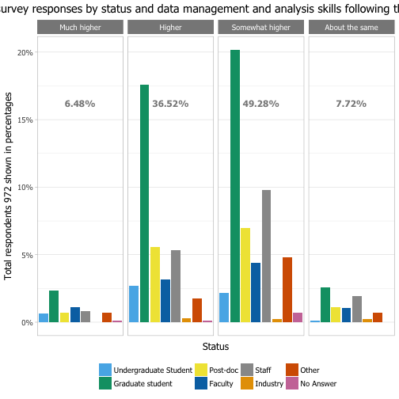

```r
# Combined plot
plotGeneric(Epostworkshop, "Post-survey", "Skill.Level.Following" , 
            "skills level following the workshop vs level of involvement",  c(3,2,4,1),"Involvement", c(3,1,2)) 
```

```
## [1] 1081   44
## [1] "Skill.Level.Following"
## [1] "Involvement"
## [1] 967  44
## [1] "Much higher"     "Higher"          "Somewhat higher" "About the same" 
## [1] "Very involved"             "Enthusiastically involved"
## [3] "Somewhat involved"        
##                  
##                   Very involved Enthusiastically involved
##   Much higher                18                        39
##   Higher                    169                       158
##   Somewhat higher           266                       121
##   About the same             38                        19
##                  
##                   Somewhat involved
##   Much higher                     4
##   Higher                         27
##   Somewhat higher                90
##   About the same                 18
```

```
## Error in grDevices::dev.off(): QuartzBitmap_Output - unable to open file './plots/Post-survey_Involvement_SkillLevelFollowing.png'
```

```r
# table(Epostworkshop$Application)
plotByStatusGeneric(Epostworkshop, "Post-survey", "Application" , "can immediately applied what was learned at the workshop", c(4,1,3,2,5))
```

```
## [1] 1081   44
## [1] "Application"
## [1] 965  44
## 
##             Agree          Disagree           Neutral    Strongly agree 
##               496                55               168               232 
## Strongly disagree 
##                14 
## [1] "Strongly agree"    "Agree"             "Neutral"          
## [4] "Disagree"          "Strongly disagree"
```

```
## Error in grDevices::dev.off(): QuartzBitmap_Output - unable to open file './plots/Post-survey_Status_Application.png'
```

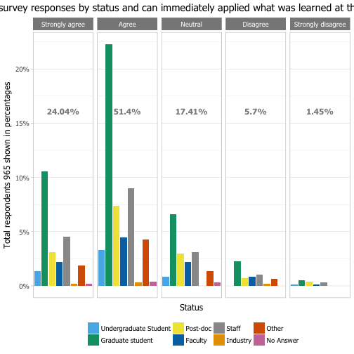

```r
# Combined plot
plotGeneric(Epostworkshop, "Post-survey", "Application" , 
            "can immediately applied what was learned vs level of involvement",  c(4,1,3,2,5),"Involvement", c(3,1,2)) 
```

```
## [1] 1081   44
## [1] "Application"
## [1] "Involvement"
## [1] 961  44
## [1] "Strongly agree"    "Agree"             "Neutral"          
## [4] "Disagree"          "Strongly disagree"
## [1] "Very involved"             "Enthusiastically involved"
## [3] "Somewhat involved"        
##                    
##                     Very involved Enthusiastically involved
##   Strongly agree               83                       136
##   Agree                       269                       152
##   Neutral                      98                        27
##   Disagree                     31                        15
##   Strongly disagree             5                         6
##                    
##                     Somewhat involved
##   Strongly agree                   12
##   Agree                            74
##   Neutral                          42
##   Disagree                          9
##   Strongly disagree                 2
```

```
## Error in grDevices::dev.off(): QuartzBitmap_Output - unable to open file './plots/Post-survey_Involvement_Application.png'
```

```r
# needs to be a big squared plot
plotGeneric(Epostworkshop, "Post-survey", "Application" , 
            "can immediately applied what was learned vs skill level prior the workshop",  c(4,1,3,2,5),"Skill.Level.Prior", c(4,1,3,2,5)) 
```

```
## [1] 1081   44
## [1] "Application"
## [1] "Skill.Level.Prior"
## [1] 960  44
## [1] "Strongly agree"    "Agree"             "Neutral"          
## [4] "Disagree"          "Strongly disagree"
## [1] "Very high"            "High"                 "Neither high nor low"
## [4] "Low"                  "Very low"            
##                    
##                     Very high High Neither high nor low Low Very low
##   Strongly agree            5   68                  106  42        9
##   Agree                     9  109                  195 134       46
##   Neutral                   0   22                   66  40       40
##   Disagree                  0   10                   29  10        6
##   Strongly disagree         0    3                    4   4        3
```

```
## Error in grDevices::dev.off(): QuartzBitmap_Output - unable to open file './plots/Post-survey_Skill.Level.Prior_Application.png'
```

```r
# table(Epostworkshop$Worth.My.Time)
plotByStatusGeneric(Epostworkshop, "Post-survey", "Worth.My.Time" , "the workshop was worth my time", c(4,1,3,2,5))
```

```
## [1] 1081   44
## [1] "Worth.My.Time"
## [1] 967  44
## 
##             Agree          Disagree           Neutral    Strongly agree 
##               408                23                49               470 
## Strongly disagree 
##                17 
## [1] "Strongly agree"    "Agree"             "Neutral"          
## [4] "Disagree"          "Strongly disagree"
```

```
## Error in grDevices::dev.off(): QuartzBitmap_Output - unable to open file './plots/Post-survey_Status_WorthMyTime.png'
```

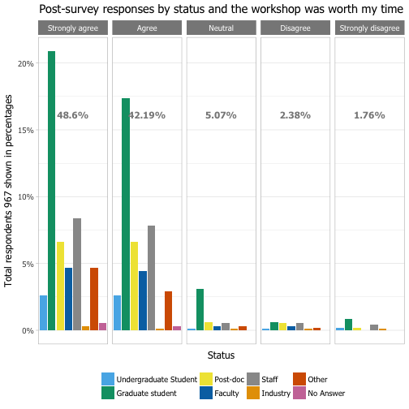

```r
# Combined plot
plotGeneric(Epostworkshop, "Post-survey", "Worth.My.Time" , 
            "the workshop was worth my time vs level of involvement",  c(4,1,3,2,5),"Involvement", c(3,1,2)) 
```

```
## [1] 1081   44
## [1] "Worth.My.Time"
## [1] "Involvement"
## [1] 964  44
## [1] "Strongly agree"    "Agree"             "Neutral"          
## [4] "Disagree"          "Strongly disagree"
## [1] "Very involved"             "Enthusiastically involved"
## [3] "Somewhat involved"        
##                    
##                     Very involved Enthusiastically involved
##   Strongly agree              205                       232
##   Agree                       235                        92
##   Neutral                      30                         4
##   Disagree                     12                         2
##   Strongly disagree             6                         7
##                    
##                     Somewhat involved
##   Strongly agree                   32
##   Agree                            80
##   Neutral                          15
##   Disagree                          8
##   Strongly disagree                 4
```

```
## Error in grDevices::dev.off(): QuartzBitmap_Output - unable to open file './plots/Post-survey_Involvement_WorthMyTime.png'
```

```r
# table(Epostworkshop$Material)
plotByStatusGeneric(Epostworkshop, "Post-survey", "Material" , "the material matched the workshop description", c(4,1,3,2,5))
```

```
## [1] 1081   44
## [1] "Material"
## [1] 966  44
## 
##             Agree          Disagree           Neutral    Strongly agree 
##               465                28                60               395 
## Strongly disagree 
##                18 
## [1] "Strongly agree"    "Agree"             "Neutral"          
## [4] "Disagree"          "Strongly disagree"
```

```
## Error in grDevices::dev.off(): QuartzBitmap_Output - unable to open file './plots/Post-survey_Status_Material.png'
```

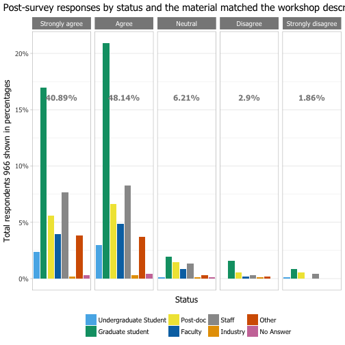

```r
# table(Epostworkshop$Recommend)
plotByStatusGeneric(Epostworkshop, "Post-survey", "Recommend" , "would recommend the workshop", c(4,1,3,2,5))
```

```
## [1] 1081   44
## [1] "Recommend"
## [1] 593  44
## 
##             Agree          Disagree           Neutral    Strongly agree 
##               261                 7                31               285 
## Strongly disagree 
##                 9 
## [1] "Strongly agree"    "Agree"             "Neutral"          
## [4] "Disagree"          "Strongly disagree"
```

```
## Error in grDevices::dev.off(): QuartzBitmap_Output - unable to open file './plots/Post-survey_Status_Recommend.png'
```

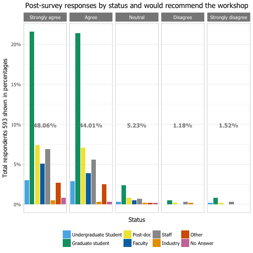

```r
# Combined plot # big square plot
# great relationship
plotGeneric(Epostworkshop, "Post-survey", "Worth.My.Time" , 
            "the workshop was worth my time vs I will recommend this workshop",  c(4,1,3,2,5),"Recommend", c(4,1,3,2,5))
```

```
## [1] 1081   44
## [1] "Worth.My.Time"
## [1] "Recommend"
## [1] 592  44
## [1] "Strongly agree"    "Agree"             "Neutral"          
## [4] "Disagree"          "Strongly disagree"
## [1] "Strongly agree"    "Agree"             "Neutral"          
## [4] "Disagree"          "Strongly disagree"
##                    
##                     Strongly agree Agree Neutral Disagree
##   Strongly agree               227    45       0        0
##   Agree                         52   198      15        0
##   Neutral                        4    12      12        1
##   Disagree                       1     5       3        5
##   Strongly disagree              1     0       1        1
##                    
##                     Strongly disagree
##   Strongly agree                    0
##   Agree                             0
##   Neutral                           0
##   Disagree                          1
##   Strongly disagree                 8
```

```
## Error in grDevices::dev.off(): QuartzBitmap_Output - unable to open file './plots/Post-survey_Recommend_WorthMyTime.png'
```

```r
# Combined plot
plotGeneric(Epostworkshop, "Post-survey", "Recommend" , 
            "I will recommend this workshop vs level of involvement",  c(4,1,3,2,5),"Involvement", c(3,1,2)) 
```

```
## [1] 1081   44
## [1] "Recommend"
## [1] "Involvement"
## [1] 590  44
## [1] "Strongly agree"    "Agree"             "Neutral"          
## [4] "Disagree"          "Strongly disagree"
## [1] "Very involved"             "Enthusiastically involved"
## [3] "Somewhat involved"        
##                    
##                     Very involved Enthusiastically involved
##   Strongly agree              111                       140
##   Agree                       157                        65
##   Neutral                      19                         3
##   Disagree                      4                         0
##   Strongly disagree             3                         4
##                    
##                     Somewhat involved
##   Strongly agree                   33
##   Agree                            38
##   Neutral                           8
##   Disagree                          3
##   Strongly disagree                 2
```

```
## Error in grDevices::dev.off(): QuartzBitmap_Output - unable to open file './plots/Post-survey_Involvement_Recommend.png'
```

```r
# Combined plot
plotGeneric(Epostworkshop, "Post-survey", "Recommend" , 
            "I will recommend this workshop vs it was worth my time",  c(4,1,3,2,5),"Worth.My.Time", c(4,1,3,2,5))
```

```
## [1] 1081   44
## [1] "Recommend"
## [1] "Worth.My.Time"
## [1] 592  44
## [1] "Strongly agree"    "Agree"             "Neutral"          
## [4] "Disagree"          "Strongly disagree"
## [1] "Strongly agree"    "Agree"             "Neutral"          
## [4] "Disagree"          "Strongly disagree"
##                    
##                     Strongly agree Agree Neutral Disagree
##   Strongly agree               227    52       4        1
##   Agree                         45   198      12        5
##   Neutral                        0    15      12        3
##   Disagree                       0     0       1        5
##   Strongly disagree              0     0       0        1
##                    
##                     Strongly disagree
##   Strongly agree                    1
##   Agree                             0
##   Neutral                           1
##   Disagree                          1
##   Strongly disagree                 8
```

```
## Error in grDevices::dev.off(): QuartzBitmap_Output - unable to open file './plots/Post-survey_Worth.My.Time_Recommend.png'
```

```r
# table(Epostworkshop$Instructors.Effective)
plotByStatusGeneric(Epostworkshop, "Post-survey", "Instructors.Effective" , "were the instructors effective in teaching the workshop?", c(1,2,5,4,3))
```

```
## [1] 1081   44
## [1] "Instructors.Effective"
## [1] 955  44
## 
##           Always Most of the time            Never        Sometimes 
##              556              294                2               31 
##          Usually 
##               72 
## [1] "Always"           "Most of the time" "Usually"         
## [4] "Sometimes"        "Never"
```

```
## Error in UseMethod("depth"): no applicable method for 'depth' applied to an object of class "NULL"
```

```r
# Combined plot
# great relationship
plotGeneric(Epostworkshop, "Post-survey", "Instructors.Effective" , 
            "were the instructors effective in teaching vs I will recommend this workshop",  c(1,2,5,4,3),"Recommend", c(4,1,3,2,5))
```

```
## [1] 1081   44
## [1] "Instructors.Effective"
## [1] "Recommend"
## [1] 583  44
## [1] "Always"           "Most of the time" "Usually"          "Sometimes"       
## [5] "Never"           
## [1] "Strongly agree"    "Agree"             "Neutral"           "Disagree"         
## [5] "Strongly disagree"
##                   
##                    Strongly agree Agree Neutral Disagree Strongly disagree
##   Always                      202   123       7        2                 7
##   Most of the time             71    98      12        2                 1
##   Usually                       8    26       3        1                 0
##   Sometimes                     1     7       7        2                 1
##   Never                         0     1       1        0                 0
```

```
## Error in grDevices::dev.off(): QuartzBitmap_Output - unable to open file './plots/Post-survey_Recommend_InstructorsEffective.png'
```

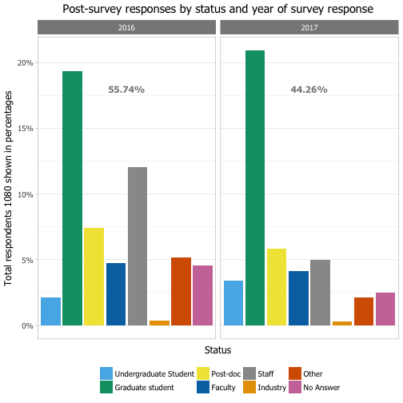

```r
# table(Epostworkshop$Instructors.Enthusiastic)
plotByStatusGeneric(Epostworkshop, "Post-survey", "Instructors.Enthusiastic" , "were the instructors enthusiastic about the workshop?", c(1,2,4,3))
```

```
## [1] 1081   44
## [1] "Instructors.Enthusiastic"
## [1] 951  44
## 
##           Always Most of the time        Sometimes          Usually 
##              755              147                6               43 
## [1] "Always"           "Most of the time" "Usually"          "Sometimes"
```

```
## Error in grDevices::dev.off(): QuartzBitmap_Output - unable to open file './plots/Post-survey_Status_InstructorsEnthusiastic.png'
```

```r
# Combined plot
# great relationship
plotGeneric(Epostworkshop, "Post-survey", "Instructors.Effective" , 
            "instructors were effective in teaching vs instructors were enthusiastic",  c(1,2,5,4,3),"Instructors.Enthusiastic", c(1,2,4,3))
```

```
## [1] 1081   44
## [1] "Instructors.Effective"
## [1] "Instructors.Enthusiastic"
## [1] 949  44
## [1] "Always"           "Most of the time" "Usually"          "Sometimes"        "Never"           
## [1] "Always"           "Most of the time" "Usually"          "Sometimes"       
##                   
##                    Always Most of the time Usually Sometimes
##   Always              532               19       2         0
##   Most of the time    194               94       3         0
##   Usually              24               27      21         0
##   Sometimes             3                7      16         5
##   Never                 0                0       1         1
```

```
## Error in grDevices::dev.off(): QuartzBitmap_Output - unable to open file './plots/Post-survey_Instructors.Enthusiastic_InstructorsEffective.png'
```

```r
# table(Epostworkshop$Workshop.in.US) 
plotByStatusGeneric(Epostworkshop, "Post-survey", "Workshop.in.US" , "the workshop was in the US", c(2,1))
```

```
## [1] 1081   44
## [1] "Workshop.in.US"
## [1] 970  44
## 
##  No Yes 
## 283 687 
## [1] "Yes" "No"
```

```
## Error in grDevices::dev.off(): QuartzBitmap_Output - unable to open file './plots/Post-survey_Status_WorkshopinUS.png'
```

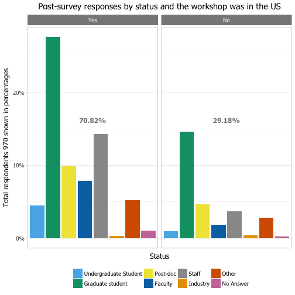

```r
# # age and gender are not shown in the PDF questionnaire
# # not very necesary as given in the presurvey
# table(Epostworkshop$Age)
plotByStatusGeneric(Epostworkshop, "Post-survey", "Age" , "age") 
```

```
## [1] 1081   44
## [1] "Age"
## [1] 387  44
## 
##             18-24             25-34             35-44             45-54             55-64 
##                66               205                65                30                12 
##             65-74 Prefer not to say 
##                 4                 5
```

```
## Error in grDevices::dev.off(): QuartzBitmap_Output - unable to open file './plots/Post-survey_Status_Age.png'
```

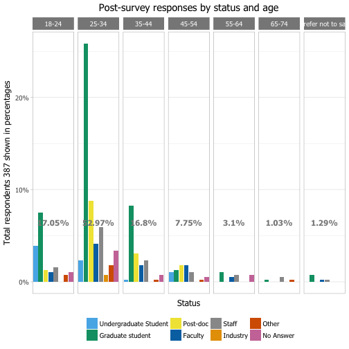

```r
# table(Epostworkshop$Race.White) # given that is the majority
plotByStatusGeneric(Epostworkshop, "Post-survey", "Race.White" , "white")
```

```
## [1] 1081   44
## [1] "Race.White"
## [1] 405  44
## 
## White/Caucasian 
##             405
```

```
## Error in grDevices::dev.off(): QuartzBitmap_Output - unable to open file './plots/Post-survey_Status_RaceWhite.png'
```


```r
# Filter all of those who did not take the survey in the US 
EpostworkshopUS <- subset(Epostworkshop, Workshop.in.US == "Yes")
EpostworkshopUS <- droplevels(EpostworkshopUS)
# table(EpostworkshopUS$Workshop.in.US)
# table(EpostworkshopUS$Gender)
plotByStatusGeneric(EpostworkshopUS, "Post-survey", "Gender" , "gender")
```

```
## [1] 687  44
## [1] "Gender"
## [1] 687  44
## 
##            Female              Male Prefer not to say         No Answer 
##               200               129                15               343
```

```
## Error in grDevices::dev.off(): QuartzBitmap_Output - unable to open file './plots/Post-survey_Status_Gender.png'
```

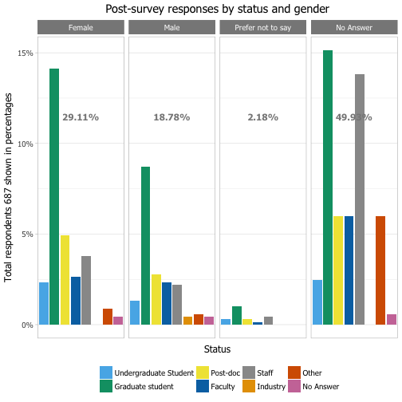

```r
# wordclouds
myWordCloud(Epostworkshop$Research, "Post-survey_Research")
```

```
## Error in Corpus(VectorSource(mydata)): could not find function "Corpus"
```

```r
# ############################################################################
```

```r
# not very interesting
multiplot(plotByGender(EpreworkshopUS, "Pre- survey"),
          plotByGender(EpostworkshopUS, "Post- survey"), cols=2)
```

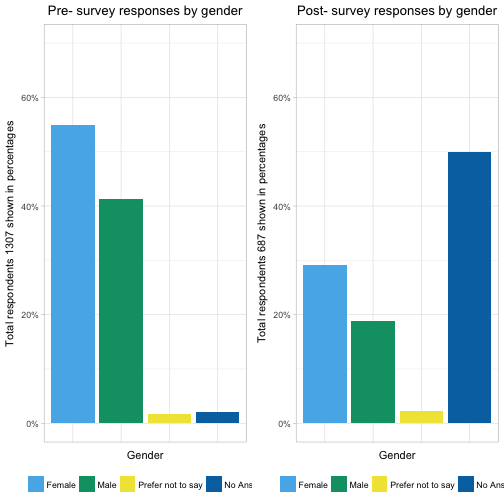

```r
# Gender and status only US surveys
plotByGenderStatus(EpreworkshopUS, "Pre-survey")
```

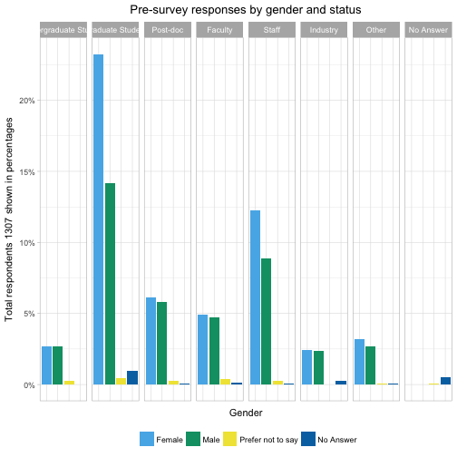

```r
plotByGenderStatus(EpostworkshopUS, "Post-survey")
```

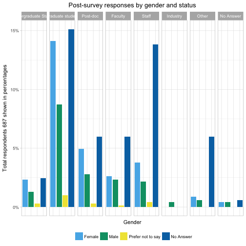

```r
# filter not answered
newpreGS <- ExcludeNANotGiven(Epreworkshop)
```

```
##      Gender    Status
## 1      Male  Post-doc
## 2      Male     Staff
## 3 No Answer     Other
## 4    Female     Other
## 5 No Answer No Answer
## 6      Male     Staff
## 'data.frame':	2343 obs. of  2 variables:
##  $ Gender: Factor w/ 4 levels "Female","Male",..: 2 2 4 1 4 2 2 2 2 1 ...
##  $ Status: Factor w/ 8 levels "Undergraduate Student",..: 3 5 7 7 8 5 2 5 4 5 ...
## NULL
## 
##            Female              Male Prefer not to say         No Answer 
##               717               540                22              1064 
##                    Status
## Gender              Undergraduate Student Graduate Student Post-doc Faculty Staff Industry Other
##   Female                               35              304       80      64   160       32    42
##   Male                                 35              185       76      62   116       31    35
##   Prefer not to say                     3                6        3       5     3        0     1
##   No Answer                            30              335      121      49    70       22    35
##                    Status
## Gender              No Answer
##   Female                    0
##   Male                      0
##   Prefer not to say         1
##   No Answer               402
##                    Status
## Gender              Undergraduate Student Graduate Student Post-doc Faculty Staff Industry Other
##   Female                               35              304       80      64   160       32    42
##   Male                                 35              185       76      62   116       31    35
##   Prefer not to say                     0                0        0       0     0        0     0
##   No Answer                             0                0        0       0     0        0     0
##                    Status
## Gender              No Answer
##   Female                    0
##   Male                      0
##   Prefer not to say         0
##   No Answer                 0
##         Status
## Gender   Undergraduate Student Graduate Student Post-doc Faculty Staff Industry Other
##   Female                    35              304       80      64   160       32    42
##   Male                      35              185       76      62   116       31    35
## [1] 1257    2
```

```r
newpostGS <- ExcludeNANotGiven(Epostworkshop)
```

```
##      Gender           Status
## 1 No Answer            Staff
## 2 No Answer            Other
## 3 No Answer            Other
## 4 No Answer Graduate student
## 5 No Answer            Staff
## 6 No Answer          Faculty
## 'data.frame':	1081 obs. of  2 variables:
##  $ Gender: Factor w/ 4 levels "Female","Male",..: 4 4 4 4 4 4 4 2 1 1 ...
##  $ Status: Factor w/ 8 levels "Undergraduate Student",..: 5 7 7 2 5 4 5 7 2 8 ...
## NULL
## 
##            Female              Male Prefer not to say         No Answer 
##               222               147                18               694 
##                    Status
## Gender              Undergraduate Student Graduate student Post-doc Faculty Staff Industry Other
##   Female                               18              101       37      19    26        0     7
##   Male                                  9               64       20      17    17        3     6
##   Prefer not to say                     2                7        2       1     5        0     0
##   No Answer                            31              263       85      59   136        4    66
##                    Status
## Gender              No Answer
##   Female                   14
##   Male                     11
##   Prefer not to say         1
##   No Answer                50
##                    Status
## Gender              Undergraduate Student Graduate student Post-doc Faculty Staff Industry Other
##   Female                               18              101       37      19    26        0     7
##   Male                                  9               64       20      17    17        3     6
##   Prefer not to say                     0                0        0       0     0        0     0
##   No Answer                             0                0        0       0     0        0     0
##                    Status
## Gender              No Answer
##   Female                    0
##   Male                      0
##   Prefer not to say         0
##   No Answer                 0
##         Status
## Gender   Undergraduate Student Graduate student Post-doc Faculty Staff Industry Other
##   Female                    18              101       37      19    26        0     7
##   Male                       9               64       20      17    17        3     6
## [1] 344   2
```

```r
plotByGenderStatus(newpreGS, "Pre-survey-filtered")
```

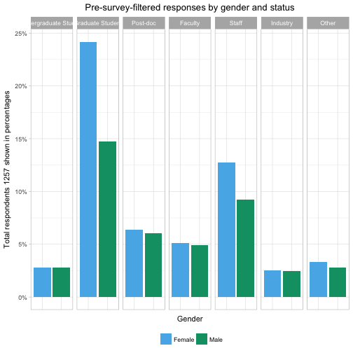

```r
plotByGenderStatus(newpostGS, "Post-survey-filtered")
```

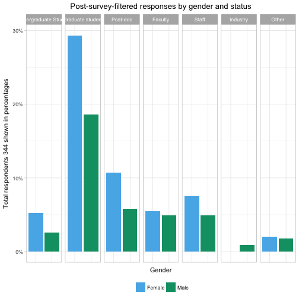

```r
# Multiplot
multiplot(plotByGender(newpreGS, "Pre-survey"),
          plotByGender(newpostGS, "Post-survey"), cols=2)
```


